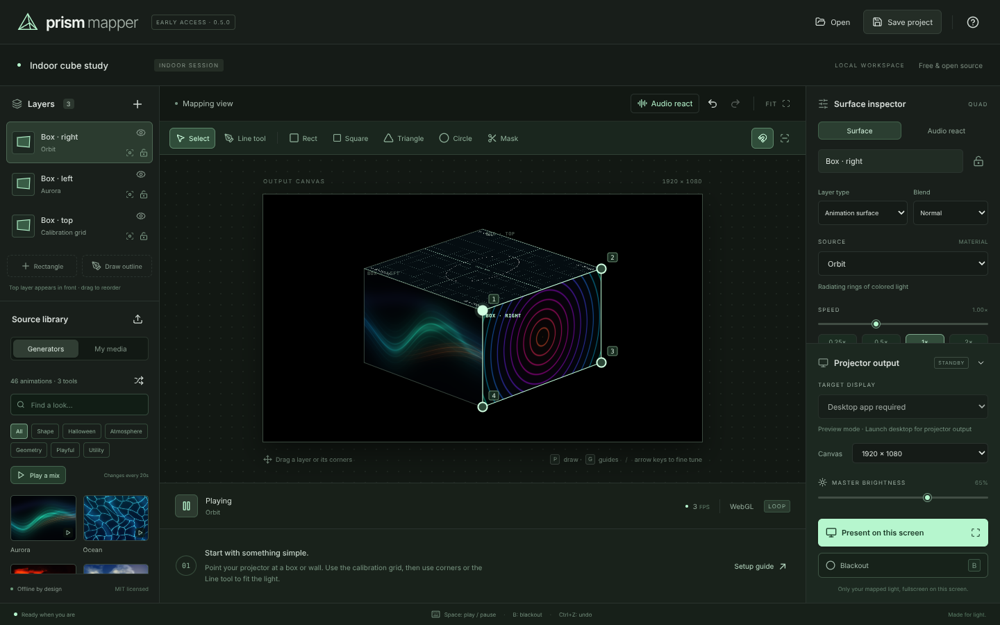
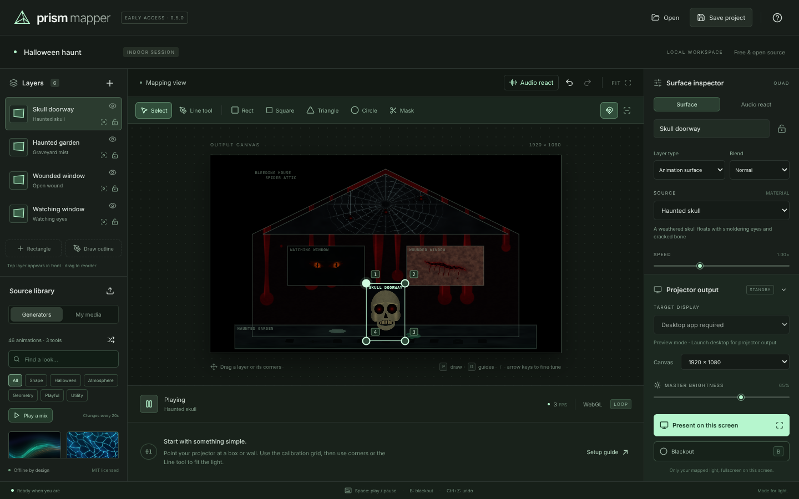
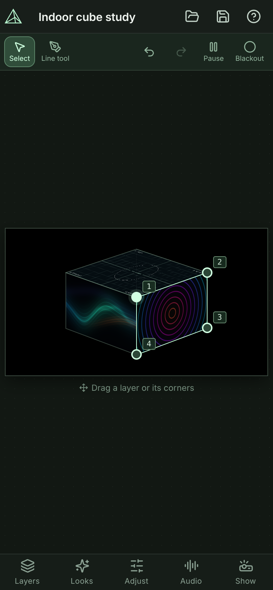
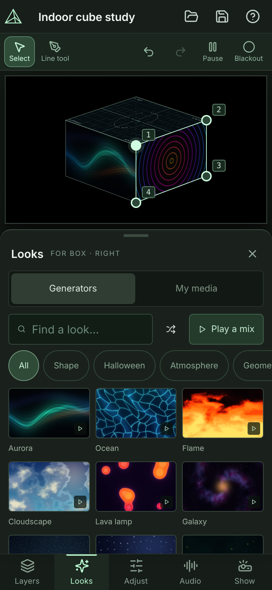

# Prism Mapper

**Free, open-source projection mapping for Windows, Mac, Android, iPhone and iPad.** Draw shapes over a wall or an object, fill them with moving light, pictures or video, and send the result to a projector. Download it from GitHub, install it on your device, and use it locally with no internet. No account, no subscription, no telemetry.

[](https://github.com/LoneForgeTechnologies/prism-mapper/actions/workflows/checks.yml)
[](LICENSE)
[](https://github.com/LoneForgeTechnologies/prism-mapper/releases/latest)



> **Please read: this is a half vibe-coded, half-tested project.** Much of the code was written by directing AI coding assistants, and the testing is only partly done. Automated tests are real and run on every change, but the apps have not been tried on every device, and the last recorded test with a physical projector was version 0.2. Expect rough edges, keep a copy of your projects, and [report what breaks](https://github.com/LoneForgeTechnologies/prism-mapper/issues/new/choose). The details are in [How well is it tested?](#how-well-is-it-tested).

## Download

Open the **[latest release](https://github.com/LoneForgeTechnologies/prism-mapper/releases/latest)**, expand **Assets**, and take the file for your device. The number in each name is the version.

| Your device                         | Download                                                                                                                                                                           |
| ----------------------------------- | ---------------------------------------------------------------------------------------------------------------------------------------------------------------------------------- |
| Windows 10 or 11, 64-bit            | The file ending in `-Windows-x64-Setup.exe` (installer), or `-Windows-x64.zip` (extract and run, no install)                                                                       |
| Mac with an Apple M-series chip     | The file ending in `-macOS-arm64.zip`                                                                                                                                              |
| Mac with an Intel processor         | The file ending in `-macOS-x64.zip`                                                                                                                                                |
| Android 7 or newer, phone or tablet | The file ending in `-Android.apk`                                                                                                                                                  |
| iPhone or iPad (iOS 15 or newer)    | The file ending in `-iOS-unsigned.ipa`, for re-signing and sideloading with your own Apple ID, or build with Xcode on a Mac. It cannot be installed directly; see the steps below. |

The Windows, Mac and Android downloads bundle the app, its runtime and all generated animations. They need no Node.js, account, server or internet during use. For a project with no internet, download the app on another computer, check its checksum, and copy it with your project and media files onto a USB drive or other local storage. Install or extract it on the offline device using the steps below. iPhone and iPad need the signing setup described below.

The **Source code** ZIP that GitHub offers next to the assets is for developers and must be built before use. Installing its dependencies initially needs internet access; use the prebuilt downloads for an offline project. Prism Mapper is not in the Google Play Store or the App Store. These community builds are not code-signed, so Windows, macOS and Android warn you the first time. That is expected, and the steps below say what to do. Every file has a SHA-256 checksum, see [Check a download](#check-a-download).

<details>
<summary><b>Windows</b></summary>

1. Run the Setup file. Windows SmartScreen may say "Windows protected your PC". Choose **More info**, then **Run anyway**, but only if you trust where you got the file.
2. By default the installer needs no administrator rights and installs for your user account. It adds a Start Menu entry and an uninstaller. Running a newer Setup over an installed copy updates it.
3. For the ZIP instead, right-click the downloaded file, choose **Properties**, tick **Unblock**, press OK, extract it, and start **Prism Mapper.exe** inside.

</details>

<details>
<summary><b>Mac</b></summary>

1. Open the ZIP, move **Prism Mapper.app** to **Applications**, and open it. macOS 12 or newer is needed.
2. The app is ad-hoc signed and not notarized by Apple. If macOS blocks it, open **System Settings → Privacy & Security** and choose **Open Anyway** after the first attempt, but only if you trust the download. [Apple explains the steps](https://support.apple.com/en-us/102445).

</details>

<details>
<summary><b>Android</b></summary>

1. Download the `.apk` on the phone and open it. Android asks you to allow installs from the app you opened it with (Chrome or Files). Allow it, go back and tap **Install**.
2. Google Play Protect may say the app comes from an unknown developer. That is true, it does not come from Google Play.
3. The app has no internet permission at all. It asks for the microphone only when you tap **Start listening**.
4. Every build carries its own temporary signature, so a newer APK cannot be installed over an older one. Uninstall the old version first, after saving your projects as files, because uninstalling deletes the app's data.
5. If the app closes by itself right after it starts, which can happen when Google Play services restart at that moment, open it again.

</details>

<details>
<summary><b>iPhone and iPad</b></summary>

iOS only runs apps signed through an Apple account, and Prism Mapper is not in the App Store. The release IPA is unsigned and cannot be installed directly.

- **Re-sign and sideload the unsigned `.ipa`** from the release with a tool such as AltStore or Sideloadly and your own Apple ID. A free Apple ID gives an app that has to be refreshed every 7 days. Plan for that expiry before relying on it for an extended offline project.
- **Build and sign it with Xcode on a Mac**, see [docs/building-mobile.md](docs/building-mobile.md).

The installed app bundles the editor and animations for local use. Downloading an IPA alone does not complete the signing and installation process.

</details>

### Check a download

Each file has a `.sha256` file, and `SHA256SUMS.txt` lists them all. On Windows run `Get-FileHash <file>` in PowerShell, on a Mac run `shasum -a 256 <file>` in Terminal. The result must equal the number in the `.sha256` file.

## What it does

The scenes and timeline features below are in the upcoming **0.6.0 development version**. They are not included in the 0.5.0 downloads.

- **Map flat faces and odd shapes.** Perspective rectangles with four draggable corners, and point-by-point outlines (3 to 64 points, inward corners allowed) for triangles, circles and anything else. Up to 32 layers.
- **An alignment outline for setting up.** Every new shape starts as a white line exactly on its edge with a black line just inside it, over a dim fill, so you can see where the corners and edges really land. Switch to the calibration grid, a checkerboard or any animation when you are ready.
- **46 original generated animations**, from aurora and ocean to fireworks, neon grids and edge effects that follow your outline, plus 12 Halloween effects. Every thumbnail is rendered by the real renderer. Or use your own pictures and looping videos.
- **Masks, blend modes and soft edges.** Keep a window dark, overlap layers with Add or Screen, feather edges, and rotate or zoom the content inside a shape without moving the outline.
- **React to sound.** Layers can pulse with the volume, bass, mids, treble or beats of a microphone or (on desktops) the system output.
- **Scenes and a local video timeline.** Capture complete mapping looks, put your MP4s in show order, set clip lengths, reorder or repeat clips, seek, pause and loop a 30–40 minute rotation. Videos use clean cuts and muted audio.
- **Quick show changes on desktop.** Save separate projects for band intro, pre-show and each set; reopen any of the eight recent project files from the timeline panel.
- **A real projector output.** On a desktop the output opens in its own window on the projector, with live edits, guides, blackout and display-sleep prevention. On a phone or tablet, **Present** fills the screen with the mapped light.
- **The same editor across installed apps.** Windows, Mac, Android, iPhone and iPad share the editor, and the same `.prism.json` project files move between them.
- **Yours.** MIT licensed, local files only, nothing leaves the device.

## Quick start

1. Connect a projector as an **extended display** (Mac: **System Settings → Displays**, Windows: **Windows + P**, then **Extend**), or just work on your own screen first.
2. Pick **Rect** for a flat face and drag its four corners until the white alignment line sits on its edges, or use the **Line tool**, click each corner in order and click the first point again to close the outline.
3. Select the layer and choose an animation in the library, or import a picture or video.
4. Add a **Mask** over anything that should stay dark. **Save project** keeps the layout.

The [Getting started guide](docs/getting-started.md) walks through it step by step, and the app has a built-in setup guide under the **?** button. Three example projects that need no media are in [`examples/`](examples).

### Build a 40-minute band rotation

In the 0.6 development version, align your surfaces first, select the surface for your videos, and open **Scenes & timeline** in the header. Choose **Add videos to timeline** and select your local MP4 files. Each video creates a scene containing the mapping and a timeline clip; the app reads its duration, or uses an editable **2:00** fallback if the metadata cannot be read. Twenty clips at **2:00** make a **40:00** rotation. Use the arrows or drag to arrange them, then enable **Loop show** and press **Play show**.

**Capture look** also saves a scene from your current layers, masks, sources and effects. **Load look** returns a scene to the mapping editor; **Update look** stores your edits back into that scene. A scene keeps its own mapping snapshot, so later edits to the base mapping do not automatically change all scenes.

Save **Band intro**, **Pre-show**, **Set 1** and **Set 2** as separate `.prism.json` files. **New show** keeps the current mapping and media while clearing the scenes and timeline. On desktop, **Quick open** offers eight recent projects. Save and keep the media beside those files before leaving for an offline venue. Shows support 128 scenes and 512 timeline clips, with a 24-hour maximum per rotation. See the [full timeline guide](docs/user-guide.md#scenes-and-timeline).



<p>
  
  
</p>

The screenshots were taken from a desktop browser, the phone ones with an emulated phone screen.

## How well is it tested?

Honestly: partly. This is what has been checked, and by what. [VALIDATION.md](VALIDATION.md) has the details of each version.

|                  | Checked by automation                                                                                                                                                                                                                                                                                    | Not checked                                                                          |
| ---------------- | -------------------------------------------------------------------------------------------------------------------------------------------------------------------------------------------------------------------------------------------------------------------------------------------------------- | ------------------------------------------------------------------------------------ |
| **Everything**   | Unit tests for geometry, project files and the release scripts. GPU and interface tests in headless Chrome with software WebGL: mapping, the animation mix, audio response, the phone and tablet layout, plus offline cache and storage regression checks in a local browser preview. All on every push. | Real graphics cards, long sessions, every picture and video format.                  |
| **Windows**      | The packaged app and the Setup installer on GitHub's Windows machines, on every release: install, start, open a project, update over a running copy, uninstall, and the portable ZIP.                                                                                                                    | A real Windows PC with a real projector. SmartScreen.                                |
| **Mac**          | The packaged app on GitHub's Apple silicon and Intel Macs, on every release: start, signature, and the app unpacked from the ZIP. Version 0.4.1 was also checked on an Apple silicon Mac before its release.                                                                                             | Gatekeeper, notarization, a Mac of your own.                                         |
| **Android**      | Built and started on emulators of Android 11, 14 and 15 and a plain Android image: the preview was drawn, the screen rotated, and the app survived its web view being killed and Google Play services being crashed.                                                                                     | A real phone or tablet, the microphone, a cable or cast to a projector, Google Play. |
| **iPhone, iPad** | Built for the simulator and for devices, and started on an iPhone and an iPad simulator. The shared editor is tested in headless Chrome.                                                                                                                                                                 | A real iPhone or iPad, full editor behavior in iOS WebKit, the App Store.            |

The last recorded test with a physical projector was version 0.2 on a Mac, and capturing the computer's own audio output has never been verified on real hardware. The phone and tablet apps were never run on a physical device.

## Documentation

- [Getting started](docs/getting-started.md): your first projection, step by step.
- [User guide](docs/user-guide.md): every tool, the keyboard, phones and tablets, audio, saving and updating, the limits.
- [Project file format](docs/project-format.md) for the `.prism.json` files.
- [Signing and distribution setup](docs/signing.md) for maintainers preparing platform credentials.
- [Building the Android and iPhone/iPad apps](docs/building-mobile.md), including signing and the store routes.
- [Changelog](CHANGELOG.md), [validation notes](VALIDATION.md), [contributing](CONTRIBUTING.md), [security](SECURITY.md) and [third-party notices](THIRD_PARTY_NOTICES.md).

## Build from source

You need **Node.js 22.12 or newer** and npm, and a computer with a graphics chip. Get the source with `git clone` or the source ZIP. The first `npm ci` downloads dependencies, including the desktop runtime, so do this while online. Then run in the project folder:

```sh
npm ci
npm start
```

On a Mac, **Launch Prism Mapper.command** does the same, and on Windows **Launch Prism Mapper.cmd** does. To make the apps yourself:

```sh
npm run package:mac       # a Mac app in release/ (on a Mac)
npm run package:release   # the release ZIP for the platform you are on
npm run cap:sync          # bundled editor assets copied into the Android and iOS projects
```

The Windows installer needs [Inno Setup 6](https://jrsoftware.org/isinfo.php) and is built by `node scripts/build-windows-installer.mjs`. The published downloads are built by the workflows in [`.github/workflows`](.github/workflows): `release.yml` for the desktop apps and the release page, and `mobile.yml` for Android and iOS. GitHub hosts the source and downloadable releases; the app runs on your device.

## Development

```sh
npm run build                 # TypeScript and production build
npm test                      # unit tests
npm run dev                   # browser preview at http://127.0.0.1:5178
```

With the dev server running, these use Chrome or Chromium:

```sh
npm run test:mapping          # polygon, mask and blend GPU checks and the editing workflow
npm run test:mix              # the automatic animation mix
npm run test:audio            # synthetic audio response and capture interface
npm run test:mobile           # phone and tablet layout, touch editing, Present mode
npm run test:show             # scene timeline, local video playback, show controls and the docked panel
npm run test:pwa              # local browser cache and storage regression (builds and serves dist/ itself)
npm run test:animations       # every material: animation, pause, speed, detail, blackout (slow)
```

The desktop checks (`npm run test:smoke`, `test:media`, `test:desktop-mapping`, `test:desktop-audio`) start the real Electron app. The code is in `src/` (editor, model, WebGL renderer, geometry), `shared/patterns.json` (the animation catalog), `electron/` (the desktop shell), `android/` and `ios/` (the Capacitor projects) and `mobile/` (their test and build scripts). The editor and the projector output share one renderer, and a narrow preload bridge carries validated state to the output, no Node API reaches the web page. See [CONTRIBUTING.md](CONTRIBUTING.md).

## Contributing and support

Bug reports are very welcome, especially from real devices and real projectors: use the [bug report form](https://github.com/LoneForgeTechnologies/prism-mapper/issues/new/choose) and include your version, system and the exact message. Pull requests are welcome too, see [CONTRIBUTING.md](CONTRIBUTING.md). There is no support team, only the people who read the issues, so please be patient.

## License

Prism Mapper is MIT licensed, see [LICENSE](LICENSE). It is independently implemented and not affiliated with MadMapper or any other product. The libraries it uses keep their own licenses ([THIRD_PARTY_NOTICES.md](THIRD_PARTY_NOTICES.md)), and the desktop apps include Electron and Chromium's notices. Pictures and videos you import belong to their creators and are not part of the project. Source, releases and issues live at [LoneForgeTechnologies/prism-mapper](https://github.com/LoneForgeTechnologies/prism-mapper).
